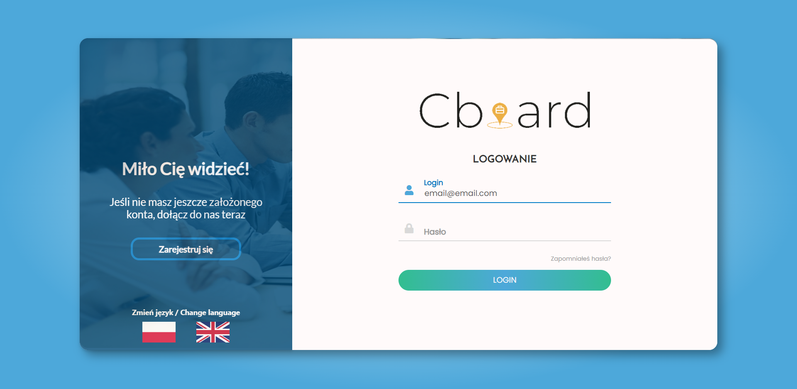
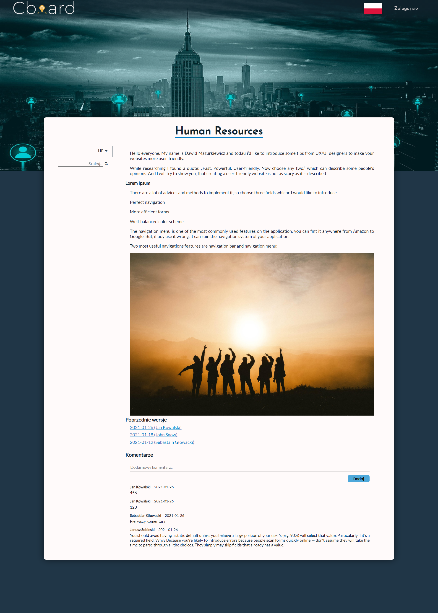
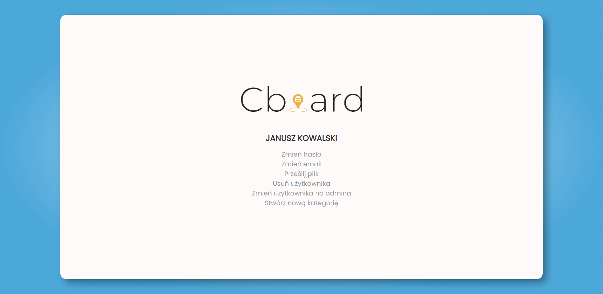

# Document your work
A webapp to uploads raports for document site, display the newest one on the website and make all able to download in unchanged form.

## Table of contents
* [Technologies](#technologies)
* [Setup](#setup)
* [Features](#features)
* [To Do](#to-do)
* [Adobe XD Mockups](#mockups)
* [Site](#site)

## Technologies
* HTML 5
* CSS 3
* JavaScript ECS6
* PHP 7
* Docker

## Setup
<p align="center">
  The page was rewritten into the Nodejs + Express [(live)](https://xd.adobe.com/view/463c1fb7-e10d-4e67-80e2-675263b31d0e-136f/specs/)
</p>
Run on local machine

```
$ docker-compose up
```

## Features

* RWD
* Read .docx file and display on the website
* Upload .docx file
* Login and registration
* User and admin panel
* Search for documents (AJAX)
* Comments section

## To do
* Password recovery (need to add sender email with verification code)
* Read .pdf files

## Mockups
[Mockups created in Adobe XD](https://xd.adobe.com/view/463c1fb7-e10d-4e67-80e2-675263b31d0e-136f/specs/)

## Site
### Landing Page
<p align="center">
  
</p>

### Login Panel
<p align="center">
  
</p>

### Content
<p align="center">
  
</p>

### Admin Panel
<p align="center">
  
</p>
